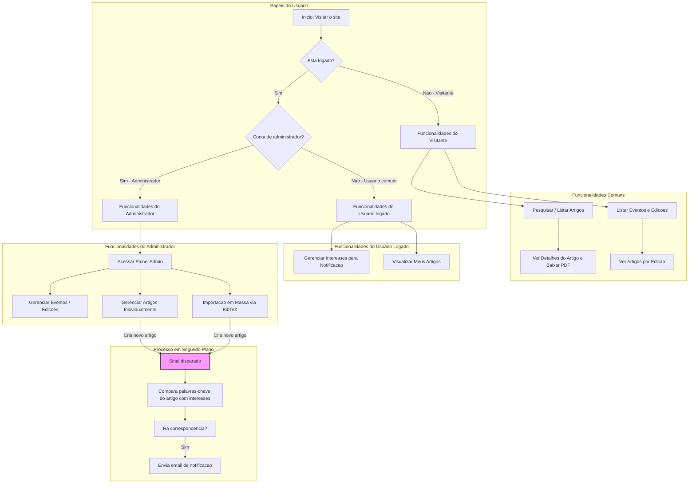

# 📚 Biblioteca Digital de Artigos

Este projeto tem como objetivo desenvolver uma **biblioteca digital** para disponibilizar **acesso fácil e centralizado aos artigos publicados** em determinados eventos científicos. A plataforma será um repositório organizado, permitindo que usuários encontrem e acessem produções acadêmicas de forma eficiente.

As principais inspirações para o desenvolvimento são plataformas consagradas como:
- **ACM Digital Library**
- **SBC Open-Lib**
- **arXiv.org**
- **dblp.org**

Nosso objetivo é criar uma ferramenta robusta para a comunidade acadêmica, facilitando a disseminação do conhecimento científico.

---

## 👥 Membros da Equipe e Papéis

| Nome | Matrícula | Papel |
|--------------|------------|-----------|
| João | 2019027695 | Fullstack |
| Luis | - | Fullstack |
| Seungbin Han | - | Fullstack |

---

## 🛠️ Tecnologias Utilizadas

- **Linguagem**: Python
- **Backend**: Django
- **Frontend**: HTML + CSS
- **Banco de Dados**: SQLite
- **Agente IA**: Cursor e Gemini

---

## 📌 Backlog do Produto

- Como administrador, eu quero cadastrar, editar e deletar um evento.
- Como administrador, eu quero cadastrar, editar e deletar uma nova edição de um evento.
- Como administrador, eu quero cadastrar, editar e deletar um artigo manualmente, incluindo seu PDF.
- Como administrador, eu quero cadastrar artigos em massa a partir de um arquivo BibTeX.
- Como usuário, eu quero pesquisar artigos por título, autor e nome do evento.
- Como administrador, eu quero que todo evento tenha uma home page com suas edições, e que cada edição tenha uma home page com seus artigos.
- Como usuário, eu quero ter uma home page com os meus artigos, organizados por ano.
- Como usuário, eu quero me cadastrar para receber um e-mail sempre que um novo artigo de meu interesse for disponibilizado.

